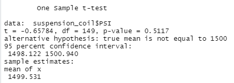

# MechaCar_Statistical_Analysis-

## Linear Regression to Predict MPG

1. Taking a look on the summary created, it is observed that both spoiler angle as well as vehicle weight have almost no impact on the mpg of the vehicle.
2. The obtained p-value of this regression model is 5.35e-11, being much smaller than the assumed significance level we are considering for this exercise. Therefore, we can reject the null hypothesis, expressing that the two means are statistically different.
3. Based on the Multiple R-squared, adjusted R-squared and p-value values, this linear model predicts mpg of MechaCar prototypes effectively.

## Summary Statistics on Suspension Coils

On one hand the Lot 1 and Lot 2 meet the design specifications since the variance of the suspension coils does not exceed 100 pounds per square inch. But on the other hand, Lot 3 variance is 220 pounds per square inch being higher than what it should.

## T-Tests on Suspension Coils

H0: there is no statistical difference between all manufacturing lots and each lot individually
Ha: there is statistical difference between all manufacturing lots and each lot individually
Population mean: 1500 lbs per square inch

## Study Design: MechaCar vs Competition

In order to create a business plan strong enough to stand out, it is necessary to find the areas of the company where they are strength and confident with, so from there try to differentiate from other competitors in the same market. To achieve this, we will need to design a statics test to compare the MechaCar vehicles with other companies.

If the price the company plans to use is to sell the vehicles at the same price as our competitors, we would have to highlight other strengths as mentioned before, for example fuel efficiency. Also, factors like distances and weather conditions will be need, and comparing the dataset with comparable vehicles from competitors.

I will need to set up a paired t-test, as we are comparing one sample data to the population data.

H0: There is no statistical difference between the observed sample mean and its presumed population mean. 
Ha: There is a statistical difference between the observed sample mean and its presumed population mean.

